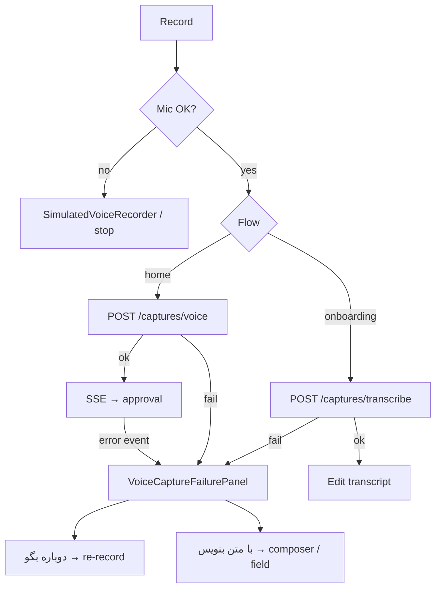

# MIRA — Agent Guide (Flutter App)

> Last updated: 2026-06-24 (memory graph screen + 768-dim embeddings)

**See also**: [`CLAUDE.md`](CLAUDE.md) (engineering rules) | [`API_BOOK.md`](API_BOOK.md) (backend contract) | [`../mira-backend/DEPLOY.md`](../mira-backend/DEPLOY.md) (CI/CD)

---

## Workspace Topology

```
Desktop/
├── Mira/              ← this repo (Flutter mobile + web UI)
├── mira-backend/      ← FastAPI API + Super Admin (separate repo)
└── (planned)          ← Next.js landing → miramind.io
```

### Production hosts

| Host | Service | Used by |
|------|---------|---------|
| https://miramind.io | Landing (placeholder → Next.js) | Browser, deep links |
| https://api.miramind.io | FastAPI | **Flutter app** (release builds) |
| https://admin.miramind.io | Super Admin | Ops / AI config (not in app) |

| Project | Path | Stack | API base URL |
|---------|------|-------|--------------|
| **mira_app** (this repo) | `C:\Users\User\Desktop\Mira` | Flutter 3.12+ | see `ApiConfig` |
| **mira-backend** | `C:\Users\User\Desktop\mira-backend` | FastAPI + MariaDB + Redis + Neo4j | **prod** `https://api.miramind.io` · **dev** `:8000` |

**Do not** add backend code inside this Flutter repo. API integration reads from [`API_BOOK.md`](API_BOOK.md).

Dev credentials: [`../mira-backend/AGENTS.md`](../mira-backend/AGENTS.md#development-credentials) · Production: [`../mira-backend/AGENTS.md`](../mira-backend/AGENTS.md#production-miramindio)

---

## Flutter App (`mira_app`)

Personal AI memory assistant UI — capture, daily brief, settings, graph (planned).

| Item | Value |
|------|-------|
| Package | `mira_app` |
| SDK | Dart `^3.12.1` |
| UI | Material + Figma-aligned design system (`components/`, `theme/`) |
| Fonts | `google_fonts` |
| SVG | `flutter_svg` |
| HTTP | `dio` + `flutter_secure_storage` |
| API config | **release** → `https://api.miramind.io` (`ApiConfig._productionBase`); **debug** → dev override / `10.0.2.2:8000` / `localhost:8000`; override compile-time: `--dart-define=API_BASE_URL=...` |

### Directory Map

```
lib/
├── main.dart                      # App entry, theme, MiraServices bootstrap
├── app/                           # AppScope, DI shell
├── core/
│   ├── api/                       # ApiClient (dio, 401 refresh)
│   ├── auth/                      # AuthRepository, TokenStorage
│   └── config/                    # ApiConfig, dev machine override
├── features/
│   ├── auth/
│   │   ├── auth_gate.dart         # Home vs OnboardingFlow bootstrap
│   │   ├── onboarding_flow.dart   # Coordinator (steps 1–5)
│   │   ├── onboarding_flow_step.dart
│   │   ├── onboarding_repository.dart
│   │   ├── screens/               # welcome, auth, your details, first capture, processing
│   │   └── widgets/               # auth_step_widgets, onboarding_flow_scaffold
│   ├── capture/                   # CaptureRepository, flow controller, sheets
│   └── graph/                     # GraphRepository, radial layout, MemoryGraphScreen
├── models/
│   ├── api/                       # auth_models, capture_models
│   └── daily_brief_models.dart    # UI models (daily brief still mock)
├── screens/                       # home, daily_brief, settings, catalog
├── components/                    # atoms / molecules / organisms (Figma)
└── theme/                         # colors, typography, tokens
test/
└── widget_test.dart               # Component catalog smoke test
```

### Current State

| Area | Status |
|------|--------|
| **Auth** | `OnboardingFlow` (welcome → email → invite? → OTP → your details → first capture → processing blur); no step counter; `GET /auth/config` before auth |
| **Capture** | Text + voice (long-press) + bubble workflow; SSE → approval; voice failure recovery in-place |
| **Home** | Figma UI + composer bar; shows GraphRAG answer when returned |
| **Daily Brief** | UI complete; **mock data** (`DailyBriefData.initialItems()`) |
| **Settings** | UI shell |
| **Graph screen** | `MemoryGraphScreen` — radial graph from `GET /graph`, node tap → blurred bottom sheet |

### Commands

```bash
flutter pub get
flutter run                    # device/emulator (debug → local API)
flutter run --release          # release → https://api.miramind.io
flutter run -d chrome          # web
flutter test
flutter analyze
```

**Release builds** use `https://api.miramind.io` automatically (`ApiConfig`).

**Debug / emulator** → `http://10.0.2.2:8000` (Android) or `http://localhost:8000`.

Production deploy: [`../mira-backend/DEPLOY.md`](../mira-backend/DEPLOY.md) · [`../mira-backend/AGENTS.md`](../mira-backend/AGENTS.md#production-miramindio).

---

## Backend Integration

1. Read [`API_BOOK.md`](API_BOOK.md) before adding any HTTP client code
2. Base URL: `ApiConfig.baseUrl` (`lib/core/config/api_config.dart`)
3. Auth: `TokenStorage` holds `access_token` + `refresh_token`; `ApiClient` attaches Bearer header
4. On `401` → `POST /auth/refresh` then retry
5. Keep API models in `lib/models/api/` mirroring `API_BOOK.md` schemas
6. **Super Admin** is backend-only (`admin.miramind.io`) — not used by this app
7. **Landing** at `miramind.io` is separate (Next.js planned) — app does not embed it

### Onboarding flow

| Phase | Screen | File(s) | Notes |
|------|--------|---------|-------|
| Welcome | «Mira. Your second mind.» | `screens/welcome_screen.dart` | Figma `724:4804` |
| Auth | Email → invite? → OTP | `screens/auth_email_steps.dart`, `auth_screen.dart` | `GET /auth/config` before email |
| Post-auth | Your details (name) | `screens/onboarding_your_details_screen.dart` | No step counter |
| Post-auth | First capture | `screens/onboarding_first_capture_screen.dart` | Text/voice demo; optional skip |
| Finish | Processing blur | `screens/onboarding_processing_screen.dart` | «MIRA understands you» → `POST /auth/onboarding` → Home |

Coordinator: `OnboardingFlow` in `onboarding_flow.dart`. Legacy profile wizard (`onboarding_screen.dart`) kept for component catalog only.

**Routing rules**

- `AuthGate`: `onboarding_completed` → `HomeScreen`; else starts at Welcome.
- After OTP: new users → your details; returning users with incomplete onboarding → your details.
- Processing screen submits minimal onboarding (`display_name` only) then enters Home.

**Auth UI widgets** (`widgets/auth_step_widgets.dart`): `AuthCtaButton`, `AuthOrDivider`, `AuthSocialButton`, `AuthLegalFooter`, `AuthShieldBadge`, `AuthOtpField`. Scaffold: `onboarding_flow_scaffold.dart`.

### Google Sign-In

Passwordless alternative to email OTP — `POST /auth/google` with Google `id_token`.

| Item | Location |
|------|----------|
| Flutter SDK | `google_sign_in` + `GoogleSignInService` |
| Client IDs | `dart_defines.json` (gitignored) — copy from `dart_defines.example.json` |
| VS Code / Cursor run | `.vscode/launch.json` passes `--dart-define-from-file=dart_defines.json` |
| Backend verify | `GOOGLE_OAUTH_CLIENT_IDS` in `.env` (Web + Android + iOS, comma-separated) |
| iOS native | `ios/Runner/Info.plist` — `GIDClientID` + reversed URL scheme |
| Android | package `com.mira.mira_app` + SHA-1 in Google Cloud Console |

Run: `flutter run --dart-define-from-file=dart_defines.json` · migration: `alembic upgrade head` · config flag: `GET /auth/config` → `google_sign_in_enabled`.

Apple Sign-In button is **hidden** in auth UI until implemented.

### Other flows (implemented)

```
AuthGate → bootstrap (tokens + GET /auth/me) → Home or OnboardingFlow
Home composer → CaptureFlowController.submitText()
             → CaptureRepository (POST /captures + SSE /stream)
             → ApprovalSheet / TimeClarificationSheet
             → approve / confirm-time / dismiss
```

### Voice capture architecture

Full STT / API error matrix: [`../mira-backend/AGENTS.md`](../mira-backend/AGENTS.md#voice-capture-architecture). API contract: [`API_BOOK.md`](API_BOOK.md) (`POST /captures/transcribe`, `POST /captures/voice`).

**Invariant:** audio is never stored on device or server after upload — failure means re-record or type manually.

| Flow | UI | API | Recovery on failure |
|------|-----|-----|---------------------|
| **Onboarding** | `onboarding_first_capture_screen.dart` | `transcribeVoice` → edit field → text submit | `VoiceCaptureFailurePanel` — **دوباره بگو** / **با متن بنویس** (focus field) |
| **Home long-press** | `VoiceRecordingScreen` + `CaptureFlowController` | `createVoiceCapture` → SSE | `CaptureUiPhase.voiceFailed` — same panel; text opens home composer |



**UI phases** (`capture_ui_phase.dart`): `idle` · `recording` · `uploading` · `processing` · `voiceFailed` · `approving`

**Client files:**

| File | Role |
|------|------|
| `capture_flow_controller.dart` | Orchestration; `retryVoiceAfterFailure()`, `openTextFallbackFromVoice()`, `dismissVoiceFailure()` |
| `capture_repository.dart` | One automatic retry on `503` / connection timeout before surfacing error |
| `utils/capture_errors.dart` | Persian user messages via `formatVoiceCaptureError()` |
| `widgets/voice_capture_failure_panel.dart` | Shared in-place recovery UI |
| `screens/voice_recording_screen.dart` | Home voice route |
| `voice/device_voice_recorder.dart` | Mic + `SimulatedVoiceRecorder` fallback |

**Client behaviour:**

- `DeviceVoiceRecorder` → `SimulatedVoiceRecorder` when permission/hardware/web fails.
- `createVoiceCapture`: dev mock pipeline on connection error / timeout / `404` / `501` (`CaptureMockData`); `401` retries multipart once after token refresh; **one silent retry** on `503` / network before failure UI.
- STT / upload / SSE `error` on voice route → `voiceFailed` (not SnackBar + pop). Save/cancel errors during approval still use SnackBar (`lastCaptureError`).
- **با متن بنویس** (Home): sets `requestTextPrompt` → pops voice screen → `AppBottomShell` opens `PromptInputBar`.
- No offline queue or failed-capture inbox.

**Backend onboarding endpoints** (see [`API_BOOK.md`](API_BOOK.md)): `GET /auth/config`, `POST /auth/email/start`, `POST /auth/invite/verify`, `POST /auth/email/verify` (creates user + tokens), `GET /auth/onboarding/status`, `POST /auth/onboarding` (saves profile, sets `onboarding_completed`).

---

## Graph screen (mobile UI)

Radial memory graph — **no extra pub package**; `InteractiveViewer` + `CustomPaint` + local force physics (`graph_physics_engine.dart`).

| File | Role |
|------|------|
| `features/graph/screens/memory_graph_screen.dart` | `GET /graph`, debounced `PUT /graph/layout` |
| `features/graph/widgets/memory_graph_canvas.dart` | Drag nodes, spring physics, pinch-zoom, tap |
| `features/graph/graph_physics_engine.dart` | Repulsion + edge springs between connected nodes |
| `features/graph/widgets/graph_node_detail_sheet.dart` | `BackdropFilter` blur + memory cards |
| `features/graph/widgets/memory_graph_icon_button.dart` | Brain icon in workflow + voice headers |

**Interaction:** drag any node (edges follow); release → physics settles; layout auto-saves to MariaDB (`graph_layouts`) after 2s. `GET /graph` returns optional `layout` with normalized `x`/`y` (0–1) per node.

Tap the psychology icon (top-right) during capture or voice recording. Tap any node → bottom sheet with summary cards and dates. Pass `highlightNodeId` to mark a newly saved memory.

---

## Graph memory & embeddings (backend contract)

Approved captures become **Neo4j graph nodes** with **768-dimensional** vectors (GraphRAG). Flutter consumes results via `GET /graph` and question answers from the capture SSE pipeline — no graph logic in the client.

### Approval → graph pipeline

```
POST /captures/{id}/approve
  → primary MemoryNode in Neo4j (+ MariaDB memory_nodes)
  → secondary entities materialized (Person, Project, …) as extra nodes
  → edges: PART_OF (Task→Project), INVOLVES (Event→Person), RELATES_TO (default)
  → embedding: 768-dim text vector (OpenRouter `dimensions=768` or normalized)
```

### Invariants (client must not duplicate)

| Rule | Backend |
|------|---------|
| Vector size | **768** — Neo4j `memory_node_embeddings` index |
| One capture | One **primary** node; `secondary` from LLM → additional nodes on approve |
| People | `Person` nodes in graph (secondary), linked with `INVOLVES` |
| Relationships | Resolved by `target_title` + `entity_resolution` flag |
| Raw input | Never stored — only approved summaries |

### GraphRAG (Home questions)

Same composer as capture → intent `question` → vector search over approved nodes → LLM answer. Requires live `embed` route (768-dim) and worker running.

**Ops:** Super Admin → Users explorer shows per-user nodes/edges. Stuck `processing` captures → flush Redis + restart worker (`../mira-backend/AGENTS.md`).

---

## Build Phases

| Phase | Backend | Flutter |
|-------|---------|---------|
| **1** ✅ | Foundation + Auth | UI prototype |
| **2** ✅ | Capture pipeline + SSE + worker | Auth + capture flow + onboarding UI |
| **3** 🔄 | Neo4j graph, GraphRAG, daily-update API | Daily brief API, graph screen (next) |
| **4** | Bots, billing | Channels, subscription UI |

---

## When Editing This Repo

- Match existing theme tokens in `lib/theme/` and component patterns in `lib/components/`
- RTL: Persian UI must use `Directionality(textDirection: TextDirection.rtl)` where needed
- Do **not** duplicate backend business logic in Flutter — consume API only
- After backend endpoint changes, sync [`API_BOOK.md`](API_BOOK.md) from `mira-backend` routers; backend deploys via GitHub Actions on push to `main`
- Component catalog: `ComponentCatalogScreen` for design-system previews

---

## Related Repos

| Doc | Location |
|-----|----------|
| Backend README | `../mira-backend/README.md` |
| Backend agents guide | `../mira-backend/AGENTS.md` |
| Deploy / CI/CD | `../mira-backend/DEPLOY.md` |
| Landing (apex) | https://miramind.io |
| OpenAPI (prod) | https://api.miramind.io/docs |
| OpenAPI (dev) | http://localhost:8000/docs |
| Super Admin (prod) | https://admin.miramind.io/admin/login — credentials in server `.env` (`ADMIN_BOOTSTRAP_*`) |
| Super Admin (dev) | http://localhost:8000/admin/login |
