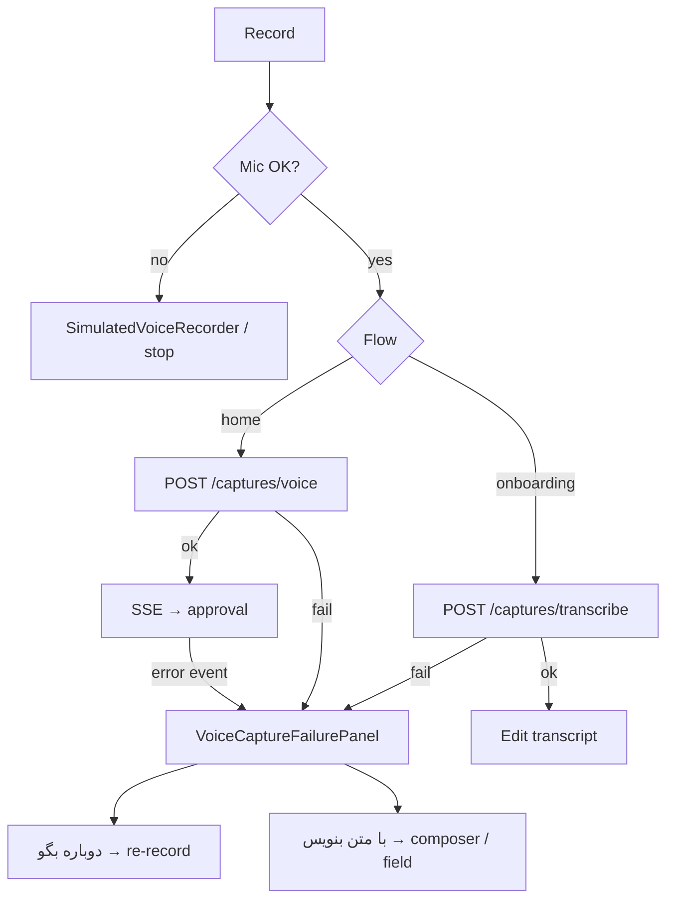

# MIRA — Agent Guide (Flutter App)

> Last updated: 2026-07-05 (Fabric-style Library intelligence, annotations, MCP/API/clipper)

**See also**: [`CLAUDE.md`](CLAUDE.md) (engineering rules) | [`API_BOOK.md`](API_BOOK.md) (backend contract) | [`../mira-backend/docs/GRAPH_V2_ARCHITECTURE.md`](../mira-backend/docs/GRAPH_V2_ARCHITECTURE.md) (graph pipeline) | [`../mira-backend/docs/GRAPH_V2_ARCHITECTURE.html`](../mira-backend/docs/GRAPH_V2_ARCHITECTURE.html) (styled doc) | [`../mira-backend/DEPLOY.md`](../mira-backend/DEPLOY.md) (CI/CD)

---

## Workspace Topology

```
Desktop/
├── Mira/              ← this repo (Flutter mobile + web UI)
├── mira-backend/      ← FastAPI API + Super Admin (separate repo)
└── (planned)          ← Next.js landing → miramind.io
```

### Production hosts

| Host | Service | Used by |
|------|---------|---------|
| https://miramind.io | Landing (placeholder → Next.js) | Browser, deep links |
| https://api.miramind.io | FastAPI | **Flutter app** (release builds) |
| https://admin.miramind.io | Super Admin | Ops / AI config (not in app) |

| Project | Path | Stack | API base URL |
|---------|------|-------|--------------|
| **mira_app** (this repo) | `C:\Users\User\Desktop\Mira` | Flutter 3.12+ | see `ApiConfig` |
| **mira-backend** | `C:\Users\User\Desktop\mira-backend` | FastAPI + MariaDB + Redis + Neo4j | **prod** `https://api.miramind.io` · **dev** `:8000` |

**Do not** add backend code inside this Flutter repo. API integration reads from [`API_BOOK.md`](API_BOOK.md).

Dev credentials: [`../mira-backend/AGENTS.md`](../mira-backend/AGENTS.md#development-credentials) · Production: [`../mira-backend/AGENTS.md`](../mira-backend/AGENTS.md#production-miramindio)

---

## Flutter App (`mira_app`)

Personal AI memory assistant UI — capture, daily brief, settings, graph (planned).

| Item | Value |
|------|-------|
| Package | `mira_app` |
| SDK | Dart `^3.12.1` |
| UI | Material + Figma-aligned design system (`components/`, `theme/`) |
| Fonts | `google_fonts` |
| SVG | `flutter_svg` |
| HTTP | `dio` + `flutter_secure_storage` |
| API config | **release** → `https://api.miramind.io` (`ApiConfig._productionBase`); **debug** → dev override / `10.0.2.2:8000` / `localhost:8000`; override compile-time: `--dart-define=API_BASE_URL=...` |

### Directory Map

```
lib/
├── main.dart                      # App entry, theme, MiraServices bootstrap
├── app/                           # AppScope, DI shell
├── core/
│   ├── api/                       # ApiClient (dio, 401 refresh)
│   ├── auth/                      # AuthRepository, TokenStorage
│   └── config/                    # ApiConfig, dev machine override
├── features/
│   ├── auth/
│   │   ├── auth_gate.dart         # Home vs OnboardingFlow bootstrap
│   │   ├── onboarding_flow.dart   # Coordinator (steps 1–5)
│   │   ├── onboarding_flow_step.dart
│   │   ├── onboarding_repository.dart
│   │   ├── screens/               # welcome, auth, your details, first capture, processing
│   │   └── widgets/               # auth_step_widgets, onboarding_flow_scaffold
│   ├── capture/                   # CaptureRepository, flow controller, sheets, Android shared import
│   ├── graph/                     # GraphRepository, radial layout, MemoryGraphScreen
│   └── workspace/                 # Library/Assistant/Plugin/Canvas/Publish repositories
├── models/
│   ├── api/                       # auth_models, capture_models
│   └── daily_brief_models.dart    # UI models (daily brief still mock)
├── screens/                       # home, daily_brief, settings, catalog, workspace surfaces
├── components/                    # atoms / molecules / organisms (Figma)
└── theme/                         # colors, typography, tokens
test/
└── widget_test.dart               # Component catalog smoke test
```

### Current State

| Area | Status |
|------|--------|
| **Auth** | `OnboardingFlow` (welcome → email → invite? → OTP → your details → first capture → processing blur); no step counter; `GET /auth/config` before auth |
| **Capture** | Text + voice (long-press) + bubble workflow; SSE → approval; voice failure recovery in-place |
| **Home** | Figma UI + composer bar; shows GraphRAG answer when returned |
| **Daily Brief** | UI complete; **mock data** (`DailyBriefData.initialItems()`) |
| **Settings** | UI shell |
| **Graph screen** | `MemoryGraphScreen` — radial graph from `GET /v2/graph`; node tap → blurred bottom sheet with mutations |
| **Daily Brief tasks** | Checkbox calls `PATCH /v2/tasks/{id}` via `GraphRepository.updateTaskStatus` |
| **Library/Search** | `LibraryScreen` lists library objects, asks assistant across them, opens item detail, and shows Fabric-style **Add anything** import hub |
| **Semantic Library** | `POST /library/search-v2` returns chunk-level matches/snippets; assistant responses include `sourceCitations` while keeping legacy `citations` |
| **Reader/Annotations** | Item detail loads chunks + annotations; users can annotate transcript/text chunks via `/library/items/{id}/annotations` |
| **Meeting Notes** | Library screen can import pasted meeting transcripts through `POST /library/meetings`; media meeting uploads are backend-supported |
| **Import Hub** | `GET /library/import-sources`; sources include PDFs, links, Markdown, text, HTML, JSON, CSV, EPUB, DOCX, PPTX, notes, meeting notes, media files, local files, YouTube/TikTok/Reels, WhatsApp/Telegram/Bale exports |
| **Connectors** | `ConnectorMarketplaceScreen`; only real provider connectors live here. WhatsApp/Telegram/Bale are not plugins; manual exports live in Import Hub |
| **Canvas** | `CanvasWorkspaceScreen`; pan/zoom board with sticky notes, text boxes, versioned library/item/chunk/embed references, shapes, arrows, auto-save to `/canvas/{id}` |
| **Media-to-text** | Library media items show thumbnail, extraction state, retry, timestamp transcript chunks, source action, and Canvas-ready media metadata |

### Commands

```bash
flutter pub get
flutter run                    # device/emulator (debug → local API)
flutter run --release          # release → https://api.miramind.io
flutter run -d chrome          # web
flutter test
flutter analyze
```

**Release builds** use `https://api.miramind.io` automatically (`ApiConfig`).

**Debug / emulator** → `http://10.0.2.2:8000` (Android) or `http://localhost:8000`.

Production deploy: [`../mira-backend/DEPLOY.md`](../mira-backend/DEPLOY.md) · [`../mira-backend/AGENTS.md`](../mira-backend/AGENTS.md#production-miramindio).

---

## Backend Integration

1. Read [`API_BOOK.md`](API_BOOK.md) before adding any HTTP client code
2. Base URL: `ApiConfig.baseUrl` (`lib/core/config/api_config.dart`)
3. Auth: `TokenStorage` holds `access_token` + `refresh_token`; `ApiClient` attaches Bearer header
4. On `401` → `POST /auth/refresh` then retry
5. Keep API models in `lib/models/api/` mirroring `API_BOOK.md` schemas
6. **Super Admin** is backend-only (`admin.miramind.io`) — not used by this app
7. **Landing** at `miramind.io` is separate (Next.js planned) — app does not embed it

### Onboarding flow

| Phase | Screen | File(s) | Notes |
|------|--------|---------|-------|
| Welcome | «Mira. Your second mind.» | `screens/welcome_screen.dart` | Figma `724:4804` |
| Auth | Email → invite? → OTP | `screens/auth_email_steps.dart`, `auth_screen.dart` | `GET /auth/config` before email |
| Post-auth | Your details (name) | `screens/onboarding_your_details_screen.dart` | No step counter |
| Post-auth | First capture | `screens/onboarding_first_capture_screen.dart` | Text/voice demo; optional skip |
| Finish | Processing blur | `screens/onboarding_processing_screen.dart` | «MIRA understands you» → `POST /auth/onboarding` → Home |

Coordinator: `OnboardingFlow` in `onboarding_flow.dart`. Legacy profile wizard (`onboarding_screen.dart`) kept for component catalog only.

**Routing rules**

- `AuthGate`: `onboarding_completed` → `HomeScreen`; else starts at Welcome.
- After OTP: new users → your details; returning users with incomplete onboarding → your details.
- Processing screen submits minimal onboarding (`display_name` only) then enters Home.

**Auth UI widgets** (`widgets/auth_step_widgets.dart`): `AuthCtaButton`, `AuthOrDivider`, `AuthSocialButton`, `AuthLegalFooter`, `AuthShieldBadge`, `AuthOtpField`. Scaffold: `onboarding_flow_scaffold.dart`.

### Google Sign-In

Passwordless alternative to email OTP — `POST /auth/google` with Google `id_token`.

| Item | Location |
|------|----------|
| Flutter SDK | `google_sign_in` + `GoogleSignInService` |
| Client IDs | `dart_defines.json` (gitignored) — copy from `dart_defines.example.json` |
| VS Code / Cursor run | `.vscode/launch.json` passes `--dart-define-from-file=dart_defines.json` |
| Backend verify | `GOOGLE_OAUTH_CLIENT_IDS` in `.env` (Web + Android + iOS, comma-separated) |
| iOS native | `ios/Runner/Info.plist` — `GIDClientID` + reversed URL scheme |
| Android | package `com.mira.mira_app` + SHA-1 in Google Cloud Console |

Run: `flutter run --dart-define-from-file=dart_defines.json` · migration: `alembic upgrade head` · config flag: `GET /auth/config` → `google_sign_in_enabled`.

Apple Sign-In button is **hidden** in auth UI until implemented.

### Other flows (implemented)

```
AuthGate → bootstrap (tokens + GET /auth/me) → Home or OnboardingFlow
Home composer → CaptureFlowController.submitText()
             → CaptureRepository (POST /captures + SSE /stream)
             → ApprovalSheet / TimeClarificationSheet
             → approve / confirm-time / dismiss
```

### Workspace Library, Import Hub, and Connectors

Mira now separates **content import sources** from **provider connectors**.

**User mental model**

- **Library → Add anything** is for files, links, pasted text, notes, meeting notes, media, local files, and manual exports.
- **Connectors** is only for real provider/API sync such as Gmail, Google Drive, Google Calendar, Notion, Slack, Dropbox, GitHub, Figma, Linear/Jira, Readwise/Zotero, RSS, Zapier, Web Clipper, and Email-to-Mira.
- WhatsApp, Telegram, and Bale are **not plugins** in v1 because personal chat OAuth/scheduled sync is not available. They appear as manual export/share flows in Import Hub.

**Flutter files**

| File | Role |
|------|------|
| `screens/workspace/library_screen.dart` | Library list/search/assistant, Add anything hub, import sheets, item detail, summarize/publish/open canvas actions |
| `features/workspace/library_repository.dart` | `/library/items`, `/library/uploads`, `/library/import-sources`, `/library/imports/link`, `/library/imports/text`, chunks, extraction retry |
| `features/workspace/library_repository.dart` | Also exposes `searchV2`, annotations, and meeting transcript import |
| `features/workspace/plugin_repository.dart` | `/plugins`, `/plugins/{id}/connect`, `/plugins/{id}/sync`; only native-sync connectors should call connect/sync |
| `screens/workspace/connector_marketplace_screen.dart` | Light/simple connector list; native Google connectors can connect/sync, adapter-ready providers show details only |
| `features/capture/shared_import/*` | Android share-sheet bridge and review screen for shared text/link/file/image into Library |
| `screens/workspace/canvas_workspace_screen.dart` | Visual board; can place Library objects via the board's Library picker |
| `models/api/workspace_models.dart` | `LibraryItem`, `ImportSourceDto`, plugin/canvas/publish DTOs |
| `models/api/workspace_models.dart` | Also models `LibrarySearchMatch`, `LibrarySearchResponse`, `LibraryAnnotation`, and assistant `sourceCitations` |

**Media-to-text UX**

Mira follows the Fabric-style product contract: every supported media item should become searchable text/chunks when possible.

| Source | Expected UX |
|--------|-------------|
| YouTube links | Import from Add anything -> item becomes `queued`; worker tries provider transcript first, then subtitles/metadata, then admin-selected media transcription if media can be fetched |
| Instagram Reels / TikTok | Import from Add anything -> no login/private scraping; public metadata/transcript attempts are best-effort; blocked/private sources become `needs_upload` |
| Uploaded audio/video | Original file remains stored securely; worker transcribes through the admin-selected `media_transcribe` route and creates timestamp chunks |
| Images/screenshots | Image item shows deferred/vision extraction status and can later receive OCR/description chunks |
| Generic links | Stored as link/readable metadata; downloadable media can be queued by backend when detected |

`LibraryItemDetailScreen` must make status explicit:

- `queued`, `extracting_metadata`, `downloading`, `transcribing`: show progress and explain the media worker is processing.
- `ready`: show transcript timeline from `GET /library/items/{id}/chunks`.
- `metadata_ready`: show metadata and explain full transcript is not available yet.
- `needs_upload` / `blocked_auth`: explain Mira does not bypass private/login walls; user should upload the file or paste a transcript.
- `failed`: show retry action via `POST /library/items/{id}/extract`.

Canvas library nodes should carry media metadata when available (`thumbnailUrl`, `extractionStatus`, duration) so boards can visually distinguish media references from plain notes/files.

**Backend contract** (see `API_BOOK.md` and `../mira-backend/src/mira/library`)

| API | Purpose |
|-----|---------|
| `GET /library/import-sources` | Fabric-style manifest for supported source types and actions |
| `POST /library/uploads` | Secure file upload, type detection, extraction status, provenance |
| `POST /library/imports/link` | URL/social/video link import; YouTube/TikTok/Reels may be `metadata_ready` until transcripts exist |
| `POST /library/imports/text` | Pasted/shared text, meeting notes, HTML, JSON, Markdown, message exports |
| `POST /library/search-v2` | Semantic/lexical chunk search with snippets, score, locator, source item |
| `POST /assistant/run` | Library assistant; returns legacy item citations plus chunk-level `sourceCitations` |
| `POST /library/meetings` | Import pasted meeting transcript or upload meeting media for transcription |
| `GET /library/items/{id}/chunks` | Transcript/OCR/text chunks; media chunks may include `startMs`, `endMs`, and `locator` timestamps |
| `GET/POST /library/items/{id}/annotations` | Reader annotations anchored to item/chunk/page/timestamp |
| `PATCH/DELETE /library/annotations/{id}` | Update/delete a reader annotation |
| `POST /library/items/{id}/extract` | Retry/requeue media extraction for failed/blocked/deferred media items |
| `GET /plugins` | Provider connector registry only; no WhatsApp/Telegram/Bale |
| `POST /plugins/{id}/connect` / `sync` | v1 direct action only for `implementationStatus == native_sync`; adapter-ready returns `409` |
| `GET/POST/DELETE /developer/api-keys` | Scoped API keys for CLI, MCP, and Web Clipper |
| `POST /mcp/tools/{tool_name}` | Authenticated MCP tool execution for search, ask, create item, list spaces |

**External tools**

- Backend CLI entrypoint: `mira` (`mira ask`, `mira search`, `mira note`, `mira link`, `mira upload`, `mira sync-folder`). It reads `MIRA_API_BASE` and `MIRA_API_TOKEN`.
- Web Clipper extension lives in `../mira-backend/tools/web-clipper-extension/` and uses a developer API key as Bearer token.
- Publish remains private-link v1 only. Full public publish polish, password UX, and analytics expansion are intentionally out of the current Fabric-parity phase.

**Import source actions**

| Action | Flutter behavior |
|--------|------------------|
| `upload_file` | Opens file picker and sends bytes to `/library/uploads` |
| `paste_link` | Opens URL sheet and sends to `/library/imports/link` |
| `upload_or_paste_text` | Opens text sheet; file upload is also available for matching extensions |
| `share_or_upload_export` | Shows guide for WhatsApp/Telegram/Bale-style exports, then upload or paste |
| `connect_provider` | Tells user provider sync lives in Connectors |
| `create_note` | Opens/pastes note content into Library |

**WhatsApp UX**

1. User exports a WhatsApp chat as `.txt` or shares selected messages/files to Mira.
2. Android share-sheet opens `SharedImportReviewScreen`.
3. Text/link/file/image is imported into Library, not capture approval.
4. Backend stores provenance such as `source: import:whatsapp_export`, `metadata.import_source: whatsapp_export`, and extraction status.
5. The imported item is searchable, askable through Assistant, publishable, and placeable on Canvas.

**Extraction status expectations**

- `ready`: text was extracted immediately and can be searched/asked.
- `metadata_ready`: link/social metadata was saved, but transcript/content extraction is not complete.
- `pending_ai`: image/PDF or visual extraction is deferred.
- `pending_transcript`: audio/video stored; transcript extraction is deferred.
- `queued`, `extracting_metadata`, `downloading`, `transcribing`: media-worker lifecycle states.
- `needs_upload`: public source did not expose usable captions/media or source is private/blocked; user must upload/paste transcript.
- `blocked_auth`: do not bypass auth/private walls.
- `failed`: file stored but immediate extraction failed.

Do not label manual-only sources as "connected", "ready to connect", or "plugins". If a provider has no real sync implementation, keep it honest with planned/details UI and route manual files/links/exports through Import Hub.

### Voice capture architecture

Full STT / API error matrix: [`../mira-backend/AGENTS.md`](../mira-backend/AGENTS.md#voice-capture-architecture). API contract: [`API_BOOK.md`](API_BOOK.md) (`POST /captures/transcribe`, `POST /captures/voice`).

**Invariant:** audio is never stored on device or server after upload — failure means re-record or type manually.

| Flow | UI | API | Recovery on failure |
|------|-----|-----|---------------------|
| **Onboarding** | `onboarding_first_capture_screen.dart` | `transcribeVoice` → edit field → text submit | `VoiceCaptureFailurePanel` — **دوباره بگو** / **با متن بنویس** (focus field) |
| **Home long-press** | `VoiceRecordingScreen` + `CaptureFlowController` | `createVoiceCapture` → SSE | `CaptureUiPhase.voiceFailed` — same panel; text opens home composer |



**UI phases** (`capture_ui_phase.dart`): `idle` · `recording` · `uploading` · `processing` · `voiceFailed` · `approving`

**Client files:**

| File | Role |
|------|------|
| `capture_flow_controller.dart` | Orchestration; `retryVoiceAfterFailure()`, `openTextFallbackFromVoice()`, `dismissVoiceFailure()` |
| `capture_repository.dart` | One automatic retry on `503` / connection timeout before surfacing error |
| `utils/capture_errors.dart` | Persian user messages via `formatVoiceCaptureError()` |
| `widgets/voice_capture_failure_panel.dart` | Shared in-place recovery UI |
| `screens/voice_recording_screen.dart` | Home voice route |
| `voice/device_voice_recorder.dart` | Mic + `SimulatedVoiceRecorder` fallback |

**Client behaviour:**

- `DeviceVoiceRecorder` → `SimulatedVoiceRecorder` when permission/hardware/web fails.
- `createVoiceCapture`: dev mock pipeline on connection error / timeout / `404` / `501` (`CaptureMockData`); `401` retries multipart once after token refresh; **one silent retry** on `503` / network before failure UI.
- STT / upload / SSE `error` on voice route → `voiceFailed` (not SnackBar + pop). Save/cancel errors during approval still use SnackBar (`lastCaptureError`).
- **با متن بنویس** (Home): sets `requestTextPrompt` → pops voice screen → `AppBottomShell` opens `PromptInputBar`.
- No offline queue or failed-capture inbox.

**Backend onboarding endpoints** (see [`API_BOOK.md`](API_BOOK.md)): `GET /auth/config`, `POST /auth/email/start`, `POST /auth/invite/verify`, `POST /auth/email/verify` (creates user + tokens), `GET /auth/onboarding/status`, `POST /auth/onboarding` (saves profile, sets `onboarding_completed`).

---

### Ambiguous intent clarification (`clarification_needed`)

When `CaptureProcessor` cannot confidently decide between **question** vs **save**, backend sets `state: clarification_needed` and sends a clarification message.

**Contract (see [`API_BOOK.md`](API_BOOK.md) · `POST /captures/{id}/clarify-intent`):**

- `state: clarification_needed` with `answer: "Could you clarify — is this a question or something to save?"`
- Client shows **two CTA buttons**:
  - «این یک سوال است» → `intent = "question"`
  - «به حافظه ذخیره کن» → `intent = "save"`
- Flutter calls `CaptureRepository.clarifyIntent(captureId, intent: ...)` which hits:
  - `POST /captures/{id}/clarify-intent` → returns **either**:
    - `state: question_answered` + `answer`  
    - `state: awaiting_approval` + `proposal`
    - (rare) `state: clarification_needed` again if backend still ambiguous

**Client files:**

| File | Role |
|------|------|
| `features/capture/capture_repository.dart` | `clarifyIntent()` → HTTP client for `/captures/{id}/clarify-intent` |
| `features/capture/capture_flow_controller.dart` | Consumes SSE `clarification` events + fallback on final `state == clarification_needed`, opens bottom sheets for intent clarification (sheet + voice flows) |
| `features/capture/screens/capture_workflow_screen.dart` | Text capture conversational flow; shows intent clarification CTA row inside `_DynamicConversationBody` |
| `features/capture/screens/voice_recording_screen.dart` | Voice route; renders `IntentClarificationPanel` when `pendingIntentClarification` is set |
| `features/capture/widgets/intent_clarification_panel.dart` | Shared CTA UI for voice route («question» vs «save») |

UX invariant: user **always** sees a clear choice and never stays indefinitely on «processing…» when backend is waiting for clarification.

---

### Localization / i18n scaffold

Flutter app uses **Flutter gen-l10n** with ARB files; new UI copy must **not** be hard-coded.

**Setup:**

- `pubspec.yaml`
  - `flutter_localizations` + `intl` dependencies
  - `flutter: generate: true`
- `l10n.yaml`
  - `arb-dir: lib/l10n`
  - `template-arb-file: app_en.arb`
  - `output-localization-file: app_localizations.dart`
- ARB files:
  - `lib/l10n/app_en.arb`
  - `lib/l10n/app_fa.arb`

**Core wiring:**

- `main.dart`
  - `import 'package:mira_app/l10n/app_localizations.dart';`
  - `onGenerateTitle: (ctx) => AppLocalizations.of(ctx)!.appTitle`
  - `localizationsDelegates: AppLocalizations.localizationsDelegates`
  - `supportedLocales: AppLocalizations.supportedLocales`

**Capture clarification strings (keys):**

| Key | Usage |
|-----|-------|
| `captureIntentClarificationPrompt` | Default prompt when backend answer is missing; used in sheet + voice flows |
| `captureIntentThisIsQuestion` | Label for «این یک سوال است» |
| `captureIntentSaveToMemory` | Label for «به حافظه ذخیره کن» |

**Client usage examples:**

- `features/capture/widgets/intent_clarification_panel.dart`
  - Reads `AppLocalizations.of(context)!` and uses `captureIntentThisIsQuestion` / `captureIntentSaveToMemory`
- `features/capture/screens/voice_recording_screen.dart`
  - Uses `l10n.captureIntentClarificationPrompt` when backend did not send a custom prompt
- `features/capture/screens/capture_workflow_screen.dart`
  - Uses `localization.captureIntentClarificationPrompt` as fallback when `_intentClarificationPrompt` is null

**Admin-managed translations (backend):**

- Super Admin exposes `/admin/api/translations` to CRUD translation rows (`locale`, `key`, `text`).
- HTML console section **Translations** in `dashboard.html` lets ops update values without redeploying.
- For now Flutter still reads from bundled ARB; when wiring live translations, use keys consistent with ARB (`captureIntent*`) and treat admin values as overrides.

When adding any new user-facing string, prefer:

1. Add key to `app_en.arb` / `app_fa.arb`
2. Use `AppLocalizations` in Dart
3. Optionally register the same key in admin translations to allow hot-fix text in production.

---

## Graph screen (mobile UI)

Radial memory graph — **no extra pub package**; `InteractiveViewer` + `CustomPaint` + local force physics (`graph_physics_engine.dart`).

| File | Role |
|------|------|
| `features/graph/screens/memory_graph_screen.dart` | `GET /v2/graph`, debounced `PUT /v2/graph/layout`, refresh on mutation |
| `features/graph/graph_repository.dart` | Fetch graph + `updateTaskStatus`, `archiveCapture`, `patchCaptureTitle`, `correctCapture`, `rejectAssertion` |
| `features/graph/widgets/memory_graph_canvas.dart` | Drag nodes, spring physics, pinch-zoom, tap |
| `features/graph/graph_physics_engine.dart` | Repulsion + edge springs between connected nodes |
| `features/graph/widgets/graph_node_detail_sheet.dart` | Blur sheet + actions by node kind (task/capture/entity) |
| `features/graph/widgets/memory_graph_icon_button.dart` | Brain icon in workflow + voice headers |

**Interaction:** drag any node (edges follow); release → physics settles; layout auto-saves to MariaDB (`graph_layouts`) after 2s. `GET /v2/graph` returns optional `layout` with normalized `x`/`y` (0–1) per node.

Tap the psychology icon (top-right) during capture or voice recording. Tap any node → bottom sheet with summary cards and mutation actions:

| Node kind | Actions |
|-----------|---------|
| `TASK` | Mark done (`DONE`), cancel (`CANCELLED`) |
| `CAPTURE` | Edit memory (title-only `PATCH` or semantic `POST /correct`), delete (`DELETE` archive) |
| `ENTITY` | Assertion list from `GET /v2/entities/{id}`; reject per assertion |

Daily brief task checkbox toggles `OPEN` ↔ `DONE` optimistically via `GraphRepository`.

i18n keys: `graphMarkDone`, `graphCancelTask`, `graphEditMemory`, `graphDeleteMemory`, … in `app_en.arb` / `app_fa.arb`.

Pass `highlightNodeId` to mark a newly saved memory.

---

## Canvas workspace (mobile UI)

Canvas v1 is a usable visual thinking board, not a placeholder.

| File | Role |
|------|------|
| `screens/workspace/canvas_workspace_screen.dart` | Board UI, toolbar, node editing, pan/zoom, library picker, auto-save |
| `features/workspace/canvas_repository.dart` | `POST /canvas`, `GET /canvas`, `GET /canvas/{id}`, `PATCH /canvas/{id}` |
| `models/api/workspace_models.dart` | `CanvasDto` JSON nodes/edges/viewport model |

**User actions**

- Create/open a canvas from the Canvas tab.
- Pan/zoom the board.
- Add sticky notes, text boxes, shapes, arrows, and Library object references.
- Tap/edit/delete canvas nodes.
- Use the Library picker from Canvas to place imported files, notes, links, WhatsApp exports, and other Library objects.
- Board changes auto-save through `PATCH /canvas/{id}`.
- The graph remains one tap away from the Canvas tab.

**Backend contract**

- `GET /canvas` lists boards by `updatedAt`.
- `POST /canvas` creates a board.
- `GET /canvas/{id}` fetches one board.
- `PATCH /canvas/{id}` persists JSON `nodes`, `edges`, and `viewport`.
- Real-time multiplayer, export PNG, and deep graph inference on canvas layout are out of v1.

---

## Graph memory & embeddings (backend contract)

Approved captures become **Neo4j graph nodes** with **768-dimensional** vectors (GraphRAG). Flutter consumes results via `GET /graph` and question answers from the capture SSE pipeline — **no graph logic in the client**.

### Entity vs memory (normalization)

The backend splits **what the user said** (memory card) from **canonical entities** (graph hubs):

| Layer | Neo4j `node_type` | Title example | Role |
|-------|-------------------|---------------|------|
| **Memory** | `Note`, `Task`, `Preference`, … | «mobbina is 39» | Approved fact the user sees in the graph sheet |
| **Entity** | `Person`, `Project`, `Topic`, … | `Mobbina`, `Volleyball` | Stable hub; deduped by `(title, node_type)` |

Rules (server-side only — see `mira-backend` `proposal_normalization.py`, `proposal_entities.py`, `graph_entity_sync.py`):

- Long-form **Person** approvals (`raw_extraction.primary.name` ≠ card title) → graph memory becomes **`Note`** + canonical **`Person`** node + `INVOLVES` edge.
- **Topics** from `topics` / `raw_extraction.topics` (e.g. `volleyball`) → **`Topic`** node + `ABOUT` from memory.
- **Projects / secondaries** from `related_nodes` / `raw_extraction.secondary` → materialized + `RELATES_TO` / `PART_OF` / `FOUNDEROF` from `relationships[]`.
- LLM alias fields normalized: `relation`→`relationship`, `target_id`→`target_node_id`, `primary`/`secondary` slots resolved via `GraphLinkContext`.
- **Mention sync** (bidirectional): new memory ↔ existing entities when title/summary contains entity name (`sync_graph_entity_mentions`).
- **Inferred semantics**: e.g. «volleyball coach» → `COACH_OF` between `Person` and `Topic` (`infer_semantic_entity_relationships`).
- Person names are **never** materialized as `Topic` (avoids `Topic Alex` vs `Person Alex`).

### Approval → graph pipeline

```
POST /captures/{id}/approve
  → resolve_graph_memory_fields (Note vs Person card, canonical titles)
  → primary MemoryNode in Neo4j (+ MariaDB memory_nodes)
  → materialize entities (Person, Project, Topic, …)
  → link_proposal_relationships (FOUNDEROF, … from relationships[])
  → sync_graph_entity_mentions (forward + backfill to older memories)
  → infer_semantic_entity_relationships (COACH_OF, …)
  → embedding: 768-dim vector (OpenRouter dimensions=768 or normalized)
```

### Edge types (Flutter displays `relationship` as-is)

| Edge | Meaning | Example |
|------|---------|---------|
| `INVOLVES` | Memory/event ↔ **Person** | «Call Alex» → Alex |
| `ABOUT` | Memory ↔ **Topic** | «Love for Volleyball» → Volleyball |
| `RELATES_TO` | General link | Note ↔ Project |
| `PART_OF` | Task → Project | Task inside a project |
| `FOUNDEROF` | Person → Project | Alex → Perfect Peach |
| `COACH_OF` | Person → Topic | Mobbina → Volleyball |

Neo4j stores types uppercased; duplicate parallel edges are **MERGE**-deduped server-side.

### Invariants (client must not duplicate)

| Rule | Backend |
|------|---------|
| Vector size | **768** — Neo4j `memory_node_embeddings` index |
| One capture | One **primary** memory node; entities are extra nodes on approve |
| Entity resolution | `find_nodes_by_title(title, node_type=…)` — same title, different types stay distinct |
| People | Canonical `Person` from `raw.name`; memory card may stay a long `Note` title |
| Topics | Concrete concepts only (`Volleyball` yes; generic `Age` / `Company` bucket no) |
| Raw input | Never stored — only approved summaries |
| Repair | Super Admin `POST /admin/api/users/{id}/repair-graph` rebuilds entities/edges from payloads |

### GraphRAG (Home questions)

Same composer as capture → intent `question` → vector search over approved nodes → LLM answer. Requires live `embed` route (768-dim) and worker running.

**Ops:** Super Admin → Users explorer shows per-user nodes/edges. Stuck `processing` captures → flush Redis + restart worker (`../mira-backend/AGENTS.md`). After graph linker changes, run **repair-graph** for affected users.

---

## Graph V2 contract (admin-first, Flutter aware)

Graph V2 ontology/predicate/assertion logic is backend-owned (`mira-backend`). Flutter should treat it as a read-only contract and must not re-implement inference/materialization rules.

### Current extraction path (V2+Context)

Production save-intent extraction uses **Graph V2** as the writer path. Miramind Lab / Graph Lab PATCH stays an optional playground compare/dry-run path and must not write production graph data.

Backend `ContextualGraphExtractor` wraps `LlmGraphExtractorV2` when `contextual_graph_extraction_enabled` is on. `CaptureProcessor` passes `user_id` so extraction can cheaply prepare:

- sentence/segment context for multi-sentence captures;
- NER mention candidates before the LLM;
- retrieval-aware graph context from existing entities/assertions/captures/tasks/neighborhood;
- a final Graph V2 schema proposal from the LLM and validator.

NER is only a candidate layer. It can help context packing and entity reuse, but Graph V2 LLM output + schema/ontology validation remain the source of truth.

Long captures are segmented in backend, but still produce one approval proposal. Assertions/tasks should keep segment-local `evidenceText` so debugging and resync stay precise.

Context packing is intentionally small for latency/cost: max 12 entities, 8 assertions, 6 captures, 6 tasks, and 12 neighborhood edges. Backend retrieval order is cheap alias/fulltext/mention first, vector only on low confidence when enabled, then capped 1-hop neighborhood by default. Flutter must not implement or tune this retrieval path.

Feature flags currently relevant to this path:

| Flag | Meaning |
|------|---------|
| `contextual_graph_extraction_enabled` | Enables Graph V2 extraction with segmentation/NER/context wrapper |
| `long_capture_segmentation_enabled` | Enables sentence/segment context for longer captures |
| `graph_extraction_embedding_cache_enabled` | Caches embeddings by provider/model/dimensions/text hash |
| `contextual_graph_extraction_vector_enabled` | Enables vector retrieval during context build; keep off unless needed |
| `contextual_graph_extraction_retrieval_aware_enabled` | Enables staged cheap retrieval before vector fallback |
| `contextual_graph_extraction_two_hop_enabled` | Enables optional 2-hop backend context; default false |
| `graph_v2_evaluation_enabled` | Enables admin-only backend scenario evaluation dry-runs |
| `mention_extraction_enabled` | Enables NER candidate extraction before LLM |

### Resync and playground QA

Super Admin exposes backend-only resync: `POST /admin/api/users/{user_id}/resync-graph-v2` with `dry_run: true` by default. Resync re-extracts approved captures safely for diff/preview and reports changed categories. Flutter does not call this endpoint.

Super Admin also exposes backend-only evaluation: `POST /admin/api/graph-v2/evaluate`. It runs the shared daily scenario catalog as dry-run, reports pass/fail, and feeds prompt/ontology/guard improvements. Flutter does not call this endpoint and should not duplicate those checks.

Playground QA path:

1. Create/select a user in Super Admin.
2. Use `POST /admin/api/playground/run` with `forced_intent: "save"`.
3. Seed a prior memory and approve it.
4. Run a related multi-sentence capture.
5. Inspect proposal `_extractionDiagnostics`.

Expected diagnostics for V2+Context: `extractorVersion: contextual_graph_v1`, `contextStrategy: graph_v2_context_v1`, non-zero `segmentCount`, `graphContextStats.strategy: retrieval_aware_v1`, retrieval confidence/vector reason, and graph context stats showing reused prior context when matching data exists.

### Graph views in Super Admin

Super Admin user inspect page supports Graph V2 views:

| View | What it shows |
|------|----------------|
| `knowledge` | User + entity/domain edges (`FOUNDED`, `HAS_ROLE_RELATION`, ...) |
| `evidence` | Capture/Mention/Assertion provenance edges (`SUPPORTED_BY`, `SUBJECT`, `OBJECT`, `CONTEXT`) |
| `hybrid` | Combined knowledge + evidence |
| `tasks` | Task nodes extracted from captures |

Admin endpoints are backend-only (`/admin/api/users/{user_id}/graph?view=...`) and not consumed by the app runtime today.

### Assertion and predicate behavior (important for app expectations)

- Ontology version **production**: `ontology.2026_06_25` — **40 predicate keys** (work, education, personal, health, travel, …). Full list: `GET /v2/ontology` or `mira-backend/AGENTS.md` ontology table.
- `predicate_key` is ontology-driven and resolved server-side from Graph V2 registry (`registry.py` + `everyday_predicates.py`).
- LLM outputs `predicateKey` and/or `predicateFamily` + `role`; backend `resolve_predicate_key()` normalizes aliases before ingest.
- Unknown/unsupported predicates still persist as assertion evidence; they may not materialize to knowledge edges.
- `NEEDS_REVIEW`/`UNKNOWN` assertions are backend review concerns; Flutter should continue rendering capture/question flows without assuming domain edge creation.
- Evidence view fixed behavior: `SUPPORTED_BY` is assertion -> capture (no assertion self-loop).

### Client invariants for Graph V2

- Keep app logic transport-only: consume API responses, do not infer `predicate_family`/`materialization` in Dart.
- Do not duplicate graph retrieval, ontology validation, scenario evaluation, or resync logic in Dart; those are backend-owned.
- Do not treat missing knowledge edges as failure; evidence may still be valid and persisted.
- If backend ontology expands (new predicates), app should remain forward-compatible by rendering unknown edge labels as-is where applicable.

---

## Build Phases

| Phase | Backend | Flutter |
|-------|---------|---------|
| **1** ✅ | Foundation + Auth | UI prototype |
| **2** ✅ | Capture pipeline + SSE + worker | Auth + capture flow + onboarding UI |
| **3** 🔄 | Neo4j graph, GraphRAG, daily-update API | Daily brief API, graph screen (next) |
| **4** | Bots, billing | Channels, subscription UI |

---

## When Editing This Repo

- Match existing theme tokens in `lib/theme/` and component patterns in `lib/components/`
- RTL: Persian UI must use `Directionality(textDirection: TextDirection.rtl)` where needed
- Do **not** duplicate backend business logic in Flutter — consume API only
- After backend endpoint changes, sync [`API_BOOK.md`](API_BOOK.md) from `mira-backend` routers; backend deploys via GitHub Actions on push to `main`
- Component catalog: `ComponentCatalogScreen` for design-system previews
- Do **not** add backend code inside this Flutter repo; backend Library/Import/Plugin logic belongs in `../mira-backend/src/mira/library`
- Do **not** put manual-only sources (WhatsApp/Telegram/Bale exports, local files, PDFs, media files, social links) in the plugin/connector list. Add them to Import Hub via `/library/import-sources`
- For provider sync UI, only native-sync connectors should show Connect/Sync. Adapter-ready providers show details/planned status until real auth/sync exists
- New Library/Import UI should keep the Mira visual system, avoid dark marketplace screens, and make the next action explicit: upload, paste link, paste text, share/export guide, or connector details

---

## Related Repos

| Doc | Location |
|-----|----------|
| Backend README | `../mira-backend/README.md` |
| Backend agents guide | `../mira-backend/AGENTS.md` |
| Deploy / CI/CD | `../mira-backend/DEPLOY.md` |
| Landing (apex) | https://miramind.io |
| OpenAPI (prod) | https://api.miramind.io/docs |
| OpenAPI (dev) | http://localhost:8000/docs |
| Super Admin (prod) | https://admin.miramind.io/admin/login — credentials in server `.env` (`ADMIN_BOOTSTRAP_*`) |
| Super Admin (dev) | http://localhost:8000/admin/login |
